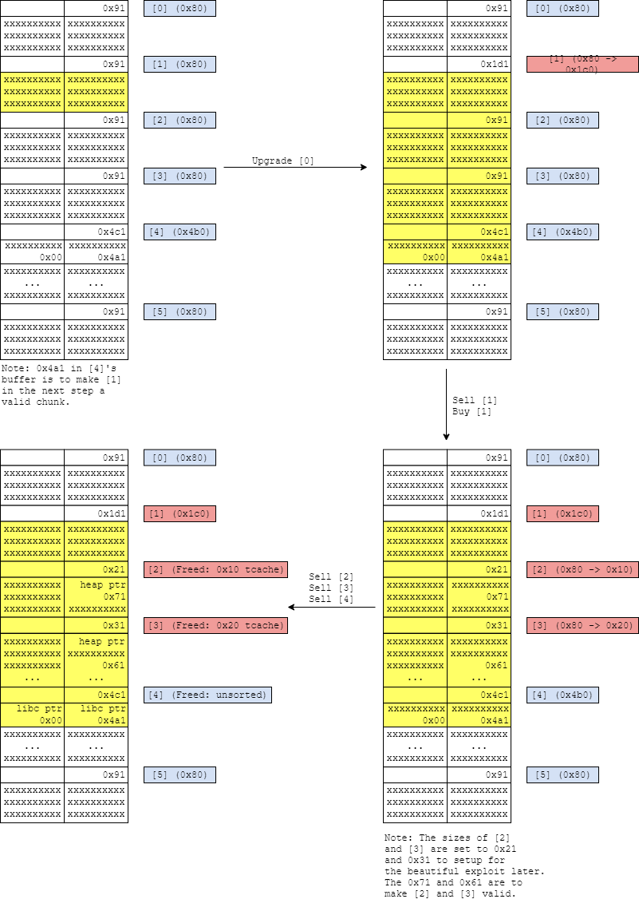
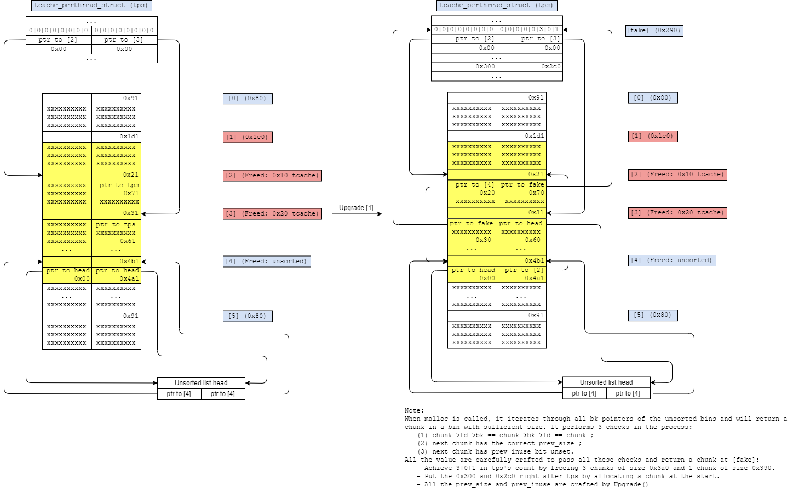

# HITCONCTF2019: LAZYHOUSE (pwn)
## First look
- Given files: `lazyhouse`, `libc.so.6`.
- Given libc's version is 2.29.
- This is a heap challenge.
- This writeup is entirely based on https://rpis.ec/blog/hitcon-quals-2019-lazyhouse/ .
## Analysis
**(1)** Integer overflow in `Sell()` can be exploited to get infinite money.

**(2)** 32-byte overflow in `Upgrade()`.

**(3)** `Buy()` uses `calloc()` instead of `malloc()`, which doesn't retrieve from tcache.

**(4)** `Buy_super()` uses `malloc()`.

**(5)** Seccomp only allows rt_sigreturn, exit_group, exit, open, read, write, brk, mmap, mprotect, close.

## Exploit plan
**Step 1:** Use (1) to get infinite money.

**Step 2:** Do the following to set up for later:
- Buy and sell 3 houses of size 0x3a0, while crafted some specific value inside.
- Buy and sell 1 house of size 0x390.
- Buy and sell 1 house of size 0x217.
- Fill the 0x1c0 and the 0x2f0 tcache bin.

**Step 3:** Leak heap and libc (yellow part on the diagram is [1]'s buffer).

**Step 4:** Have `Buy()` returns a chunk in `tcache_perthread_struct`, and overwrite the `tcache_entry` of the 0x220 list to `__free_hook`.

**Step 5:** Overwrite `__free_hook` with `__uflow()` and call it on a fake carefully crafted FILE struct to leak stack and overwrite `__malloc_hook` with `gets()`.

**Step 6:** Call `malloc() -> gets()` and overwrite its own ret on the stack to ROP to open -> read -> write.

## Full exploit
See `solve.py`.
